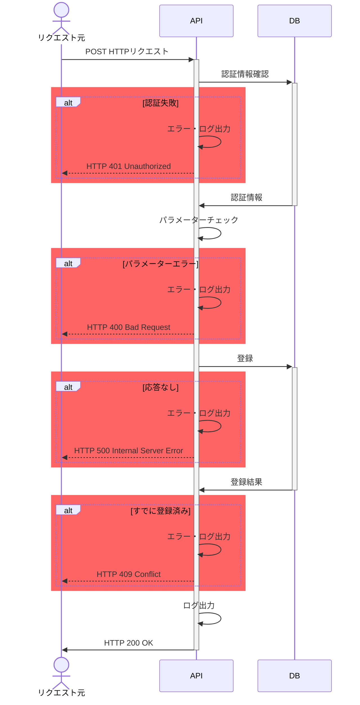

```mermaid

sequenceDiagram
    actor リクエスト元
    participant API as API
    participant DB as DB

    リクエスト元 ->>+ API: POST HTTPリクエスト
    
    API ->>+ DB: 認証情報確認
        rect rgb(255, 100, 100)
            alt 認証失敗
                API ->> API: エラー・ログ出力
                API -->> リクエスト元: HTTP 401 Unauthorized
            end
        end
    DB ->>- API: 認証情報

    API ->> API: パラメーターチェック
        rect rgb(255, 100, 100)
            alt パラメーターエラー
                API ->> API: エラー・ログ出力
                API -->> リクエスト元: HTTP 400 Bad Request
            end
        end

    API ->>+ DB: 登録
        rect rgb(255, 100, 100)
            alt 応答なし
                API ->> API: エラー・ログ出力
                API -->> リクエスト元: HTTP 500 Internal Server Error
            end
       end
    DB ->>- API: 登録結果
        rect rgb(255, 100, 100)
            alt すでに登録済み
                API ->> API: エラー・ログ出力
                API -->> リクエスト元: HTTP 409 Conflict
            end
        end

    API ->> API: ログ出力
    API ->>- リクエスト元: HTTP 200 OK

```